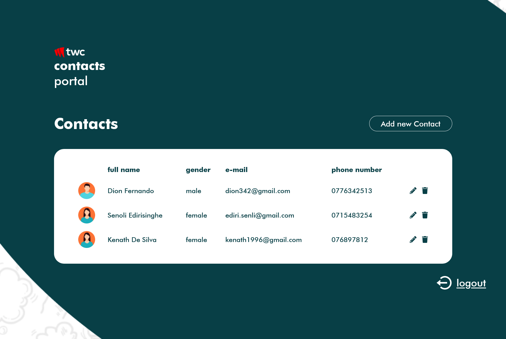

# Contacts Portal App Solution

In this small app user can register and manage their own personal contacts




Link to the application: https://yn-contacts-portact-twc.netlify.app/

### Try it out with these fake credentials

- email:abc@gmail.com
- Password: pass123

## Conecpts used

- use Newest Version of react router with its new features
- mongo db validations
- create Private Routes
- jwt token and refresh token
- express session
- mongodb atlas
- mvc architecture

## Features

- CRUD functionalities
- User authentication and authorization (JWT authentication)


## Tools and technologies used

- Taiwlind
- vite
- React + Hooks + Context
- React Router
- Nodejs + Express
- Mongo db
- express sessions
- jsonwebtokens
- bcrypt

## Get started

Open a terminal and clone this repo:

```bash
# Clone this repository
$ git clone https://github.com/Yehan20/twc-test-web.git

# Go into the repository
$ cd twc-test-web

# Remove current origin repository
$ git remote remove origin

# If you want, you can add a new remote repository
$ git remote add origin https://github.com/<your-github-username>/<your-repo-name>.git


# Install dependencies
$ npm install


# run the server
$ npm run dev
```


At this point and the client app running in the browser at http://127.0.0.1:5173/<br />.


